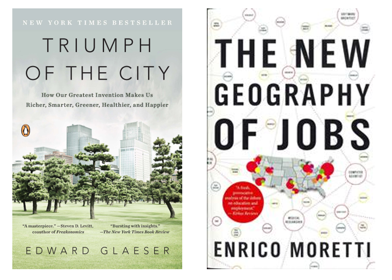

```{r, echo=F, message=F}
knitr::opts_chunk$set(
  echo = F,
  warning = F,
  message = F
)
library(xaringan)
library(xaringanExtra)
library(tidyverse)
library(here)
library(xaringanthemer)

```

```{r xaringan-themer, include=FALSE, warning=FALSE}
style_mono_accent(
  base_color = "#2b8cbe",
  header_font_google = google_font("Noto Serif JP"),
  text_font_google   = google_font("Lato", "400", "400i"),
  code_font_google   = google_font("IBM Plex Mono")
)
```

```{r xaringanExtra, echo=FALSE, warning=FALSE}
xaringanExtra::use_tile_view()

xaringanExtra::use_progress_bar(color = "#0051BA", location = "top", height = "10px")
```

```{r setup, include=FALSE}
options(htmltools.dir.version = FALSE)
```

---
class: center, inverse

## The Gift of Moving:

### Intergenerational consequences of a mobility shock

```{r, echo=FALSE, out.width=500}

```

---

### No longer a working paper!

```{r}
knitr::include_url("https://academic.oup.com/restud/advance-article/doi/10.1093/restud/rdab062/6372705")
```


---

## Authors

--


---

## Authors

.pull-left[


]

.pull-right[

- Use micro data to look at macro questions

- They care about labour and distributional outcomes

- Part of the [credibility revolution](https://www.vox.com/the-highlight/2019/5/14/18520783/harvard-economics-chetty) in macro

]

---
## Why is this paper relevant?

- What is it about?

- How does it contribute to the literature?

- What are the findings?

---

## What is it about?

.pull-left[


]

.pull-right[

#### Volcano!

#### Compelling natural experiment

#### Heterogenous effects of migration

]

---

## How does it contribute to the literature?

.pull-left[



]

.pull-right[

#### Backdrop

[**"Our Greatest Invention Makes Us Richer, Smarter, Greener, Healthier, and Happier"**](https://youtu.be/Dsofgp01tZs) - Ed Glaeser

[**"The vast majority of our jobs are not in high tech, not in manufacturing; they are in the local service sector... taxi drivers and waiters, doctors, lawyers, nurses" but productivity gains in tech hubs raise wages in these professions in the localities of these high productivity sectors**](https://www.econtalk.org/moretti-on-jobs-cities-and-innovation/#audio-highlights) - Enrico Moretti

]

---
## What are the findings?

```{r, fig.height=5}
df <- read_rds(here("economic-geography-reading-group", "data", "marginal-treatment-effect-df.rds"))

df %>% 
    mutate(type = "Point estimate",
           across(c(x, y), round)) %>% 
    ggplot(aes(x, y, colour = type)) +
    geom_point(cex = 4) +
    geom_line(cex = 2) +
    geom_hline(lty = 2, 
               cex = 2,
               aes(yintercept = 26700, colour = "Point estimate mean")) +
    scale_y_continuous(labels = scales::dollar_format()) +
    xaringanthemer::theme_xaringan() +
    scale_color_manual(values = c("#2b8cbe", "midnightblue")) +
    labs(x = "Quantile of income distribution",
         y = "Treatment effect ($)",
         colour = NULL) +
    theme(legend.position = "bottom")
```


