class: center, inverse

```{r, echo=F, message=F}
knitr::opts_chunk$set(
  echo = F,
  warning = F,
  message = F,
  fig.align = 'center',
  dev = "svg"
)
library(xaringan)
library(xaringanExtra)
library(tidyverse)
library(here)
library(xaringanthemer)

```

```{r xaringan-themer, include=FALSE, warning=FALSE}
style_duo_accent(
  secondary_color = "#bdc9e1",
  primary_color = "#0570b0",
  link_color = "#2b8cbe",
  
  header_font_google = google_font("Noto Serif JP"),
  text_font_google = google_font("Lato", "400", "400i"),
  code_font_google = google_font("IBM Plex Mono")
)
```

```{r xaringanExtra, echo=FALSE, warning=FALSE}
xaringanExtra::use_tile_view()
xaringanExtra::use_panelset()
xaringanExtra::use_progress_bar(color = "#0570b0", location = "top", height = "10px")
```

```{r setup, include=FALSE}
options(htmltools.dir.version = FALSE)
```


## The Gift of Moving:

### Intergenerational consequences of a mobility shock

```{r, echo=FALSE, out.width="70%"}
knitr::include_graphics("images/volcano-cover-2.jpg")
```

---

### No longer a working paper!

```{r}
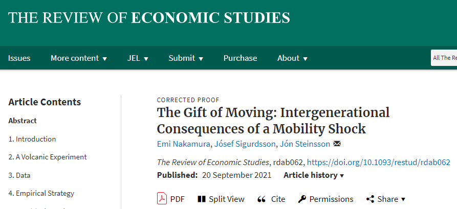
```


---

## Authors


---

## Authors

.pull-left[


]

.pull-right[

- Use micro data to look at macro questions

- They care about labour and distributional outcomes

- Part of the [credibility revolution](https://www.vox.com/the-highlight/2019/5/14/18520783/harvard-economics-chetty) in macro

]

---
## Why is this paper relevant?

- What is it about?

- How does it contribute to the literature?

- What are the findings?

---

## What is it about?

.pull-left[


]

.pull-right[

#### Volcano!

Lowers the cost of mobility for families whose homes destroyed. cf. Bengt's trains.

#### Compelling natural experiment

Random assignment. Binary instrument and response. 

Similar to Tancredi's paper on China, but less endogeneity!

Westman Islands are high income area, not dying town.

#### Heterogenous effects of migration

Impact on young vs old - cf. Clara.

]

---

## How does it contribute to the literature?

.pull-left[


]

.pull-right[

#### Backdrop

["Our Greatest Invention Makes Us Richer, Smarter, Greener, Healthier, and Happier"](https://youtu.be/Dsofgp01tZs) - Ed Glaeser

["The vast majority of our jobs are not in high tech, not in manufacturing; they are in the local service sector... taxi drivers and waiters, doctors, lawyers, nurses" but productivity gains in tech hubs raise wages in these professions in the localities of these high productivity sectors](https://www.econtalk.org/moretti-on-jobs-cities-and-innovation/#audio-highlights) - Enrico Moretti

]

---
class: inverse

## How does it contribute to the literature?

### Helps us to disentangle the selection effect from the returns to migration

---
## What are the findings?

.pull-left[


Where the outcome is labour income:

**Compliers age [0-25] at time of eruption earn more over their lifetimes**

But their parents are marginally worse off
]

.pull-right[


Where the outcome is schooling:

**Compliers age [0-25] at time of eruption attain more education**

]

---

## What do they mean?

.pull-left[

As the cost of migrating decreases, individuals are freed to take up occupations that are better suited to their skill set. 

If we want to ensure a labour market functions effectively, we should think carefully about how to implement policy in light of this result.

E.g. did the Rehn-Meidner Swedish model effectively encourage the **right people** to migrate internally?

]

.pull-right[

```{r, out.width="80%"}

```


]

---
## Setting

```{r, fig, out.width="80%", fig.cap="The Eldfell Eruption of 1973 - The Atlantic"}
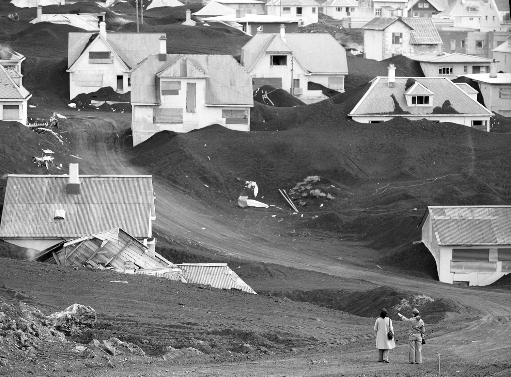
```

---
## Setting

```{r, out.width="60%"}
knitr::include_graphics("images/volcano_map.png")
```
---
## Data

.pull-left[

- Register data on Westman Islands inhabitants

- Follow these individuals after volcanic eruption

- Track their labour market and education outcomes

- Coverage on earnings data is **95 percent of population of interest**

- Education data is complete

]
.pull-right[

```{r, out.width="100%", fig.cap="A year before the eruption, the fishing village of Vestmannaeyjar, is shown in this 1972 photo, nestled between the sea and the Helgafjell Volcano"}
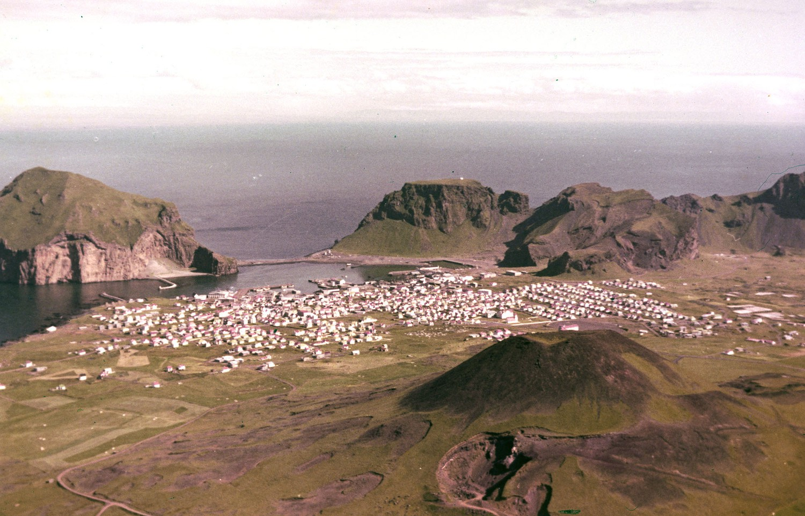
```

]
---
## Instrument

.pull-left[
Families whose houses were destroyed were more likely to move away from the Westman Islands permanently.

So the authors instrument for $$Moved_i$$ with an indicator variable for whether the person lived in a house which was $$Destroyed_i$$ during the eruption.
]

.pull-right[

```{r, out.width="100%", fig.cap="A structure destroyed by the eruption, in Heimaey, on July 24, 1974."}
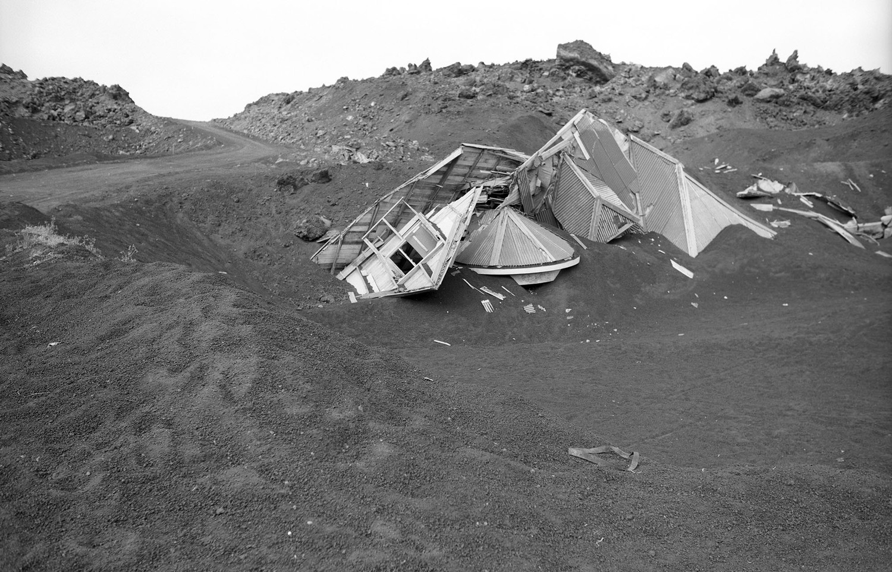
```

]

---
## LATE

Authors estimate the [Local Average Treatment Effect](https://www.nber.org/system/files/working_papers/t0118/t0118.pdf) for the compliers - those who were shocked by the instrument into the treatment group

The effect for the general population will be smaller as "compliers in our experiment are a subgroup of the population that is **less well matched** to living in the Westman Islands than the average person living there."

---
## LATE: Requirements

.pull-left[

- Independence assumption

- Exclusion restriction

- Monotonicity assumption

- Existence of a first stage

]

.pull-right[


]

---
## LATE: Independence

.pull-left[

#### Requirement

- Instrument is independent of the potential outcomes and potential treatment assignment

]

.pull-left[

#### Is it met?

- House destruction was **as good as random** within the town. Spatial correlation shown to be unimportant

]

---

## LATE: Independence: house age

.panelset[
.panel[.panel-name[House age map]

```{r, fig.height=5.5, fig.width=10}
library(haven)

df <- read_rds(here( "data", "house_locations.rds"))
df_boundary <- read_rds(here( "data", "boundary.rds"))

 ggplot() +
  geom_point(aes(longitude, latitude, colour = house_year, shape = destroyed), data = df, size = 2) +
  geom_tile(aes(longitude, latitude, fill = .pred_class), data = df_boundary, alpha = .1, size = 5, show.legend = F) +
  scale_color_gradient2(
    low = "#fc8d59",
    high = "#99d594",
    mid = "#ffffbf",
    midpoint = 1935
  ) +
  scale_fill_grey() +
  theme_xaringan() +
  labs(
    x = NULL,
    y = NULL,
    colour = "Year of construction",
    shape = NULL
  ) +
  theme(
    legend.position = "bottom",
    panel.grid = element_blank(),
    axis.text = element_blank()
  ) +
  guides(
    shape = guide_legend(nrow = 2),
    colour = guide_colorbar(
      barwidth = 20,
      title.position = "top"
    )
  )
```

]

.panel[.panel-name[House age density]

```{r, fig.height=5.5, fig.width=10}
df %>%
  ggplot(aes(house_year, fill = destroyed)) +
  geom_density(alpha = .5) +
  scale_x_continuous(labels = scales::number_format(big.mark = "")) +
  theme_xaringan() +
  scale_fill_manual(values = c("#fc8d59", "#99d594")) +
  labs(
    x = "Year of house construction",
    y = NULL,
    fill = NULL
  ) +
    theme(legend.position = "bottom")
```

]
]

---

## LATE: Independence: house value

.panelset[
.panel[.panel-name[House price map]

```{r, fig.height=5.5, fig.width=10}
ggplot() +
  geom_point(aes(longitude, latitude, colour = house_total_value, shape = destroyed), data = df, size = 2) +
  geom_tile(aes(longitude, latitude, fill = .pred_class), data = df_boundary, alpha = .1, size = 5, show.legend = F) +
    scale_color_gradient2(
    low = "blue",
    high = "red",
    mid = "pink",
    midpoint = log10(40000),
    trans = "log10",
    labels = scales::dollar_format()
  ) +
    scale_fill_grey() +
    scale_shape_manual(values = c(19, 17)) +
    theme_xaringan() +
  labs(
    colour = "House value",
    shape = NULL,
    x = NULL,
    y = NULL
  ) +
    theme(legend.position = "bottom",
          panel.grid = element_blank(),
          axis.text = element_blank()) +
    guides(shape = guide_legend(nrow = 2),
           colour = guide_colorbar(barwidth = 20,
                                   title.position = "top"))
```

]

.panel[.panel-name[House price density]

```{r, fig.height=5, fig.width=10}
df %>%
  ggplot(aes(house_total_value, fill = destroyed)) +
  geom_density(alpha = .3) +
  scale_x_log10(labels = scales::dollar_format()) +
  theme_xaringan() +
  scale_fill_manual(values = c("#2b8cbe", "darkred")) +
  labs(
    x = "House value",
    y = NULL,
    fill = NULL
  ) +
  theme(legend.position = "bottom")
```

]
]

---
## LATE: Exclusion restriction

.pull-left[

#### Requirement

- Any effect of instrument on outcome must be through the treatment

- The instrument operates through a single known causal channel

]

.pull-left[

#### Is it met?

- House destruction can impact lifetime income & education only through moving away from Westman Islands

- What about the wealth shock?

- What about massive inflation?

- Etc?

]

---
## LATE: Monotonicity assumption

.pull-left[

#### Requirement

- AKA "No defiers assumption"

- We need the absence of anyone who would have left the Westman Islands but who were pushed to stay by the volcano.
]

.pull-left[

#### Is it met?

- Seems totally reasonable.

]

---
## LATE: Existence of a first stage

.pull-left[

#### Requirement

- Significant first-stage of the instrument on treatment

- Empirically testable

- Rule of thumb requires F-stat > 10

]

.pull-left[

#### Is it met?


]


---
## Balance tests

```{r, fig.width=4, out.width="80%"}
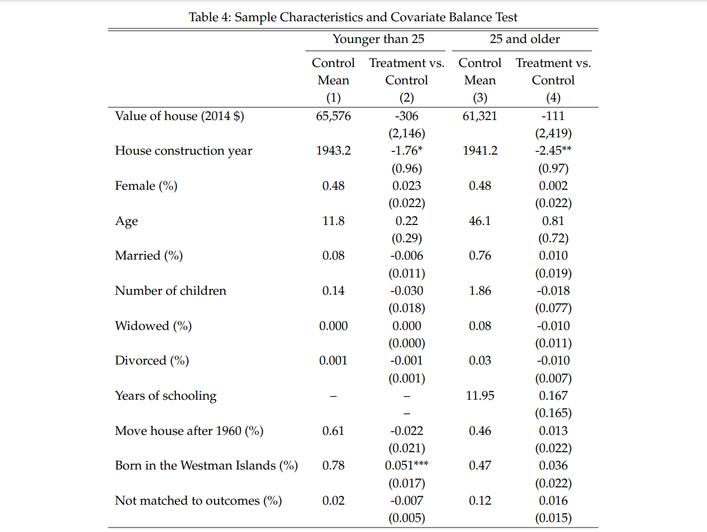
```

---
## Balance tests

.pull-left[
#### Measured differences

- Houses destroyed on average 2 years older (mean of house age is 30)

- The treatment group is somewhat more likely to have been born in the Westman Islands (83% versus 78% for the control
group)

- But can't reject that this is just random noise


]

.pull-left[
#### Unobserved differences?

- Are there any reasonable sorting hypotheses that would make inhabitants of destroyed houses different?

]

---

## Estimation results: labour income

--

**Wald Estimator** for income of those younger than 25 at time of eruption:

Formula:

$$ \frac{E[income_i|destroyed_i] - E[income_i|not destroyed_i]}{E[moved_i|destroyed_i] - E[moved_i|not destroyed_i]} $$
Numbers:

$$ \frac{$3,000}{11.4\%} = $26,600 $$
---

## Estimation results: labour income

```{r, out.width="80%"}
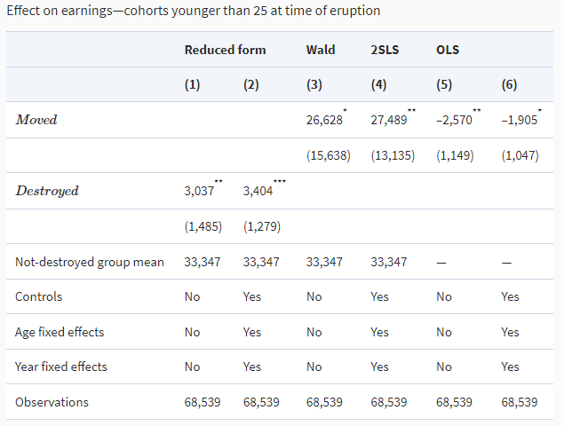
```

---

## Estimation results: labour income

```{r, out.width="80%"}
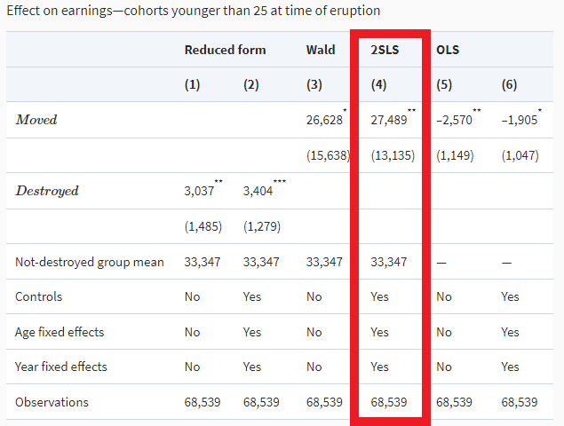
```

---
## Estimation results: life time income

```{r age-plot, fig.width=8, fig.height=5}
df <- read_rds(here::here( "data", "life-cycle-earnings.rds"))

df %>% 
    ggplot(aes(x, y, colour = series)) +
    geom_line(cex = 2, alpha = .5) +
    theme_xaringan() +
    theme(legend.position = "bottom") +
    scale_colour_viridis_d() +
    scale_y_continuous(labels = scales::dollar_format()) +
    labs(x = "Age",
         y = "Average earnings \n(2014 Dollars)",
         colour = NULL)
```

---
## Estimation results: driven by high earners?

```{r mte-fig-out, ref.label="mte-fig", echo=FALSE, warning=FALSE, fig.height= 5, out.width="80%"}

```

---
## Estimation results: driven by high earners?

.pull-left[
No, trimming the distribution to just between 15th and 85th percentiles reduces the effect, but not substantially.

From an effect size of 83 percent of the control group's income to 60 percent.
]

.pull-right[

```{r mte-fig-out-2, ref.label="mte-fig", echo=FALSE, warning=FALSE, fig.height= 5, out.width="100%"}

```

]

---
## What about the parents income?

```{r, out.width="80%"}
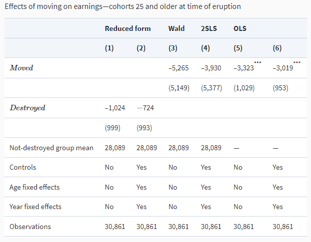
```


---
## So who benefits w.r.t income?

```{r, out.width="80%"}
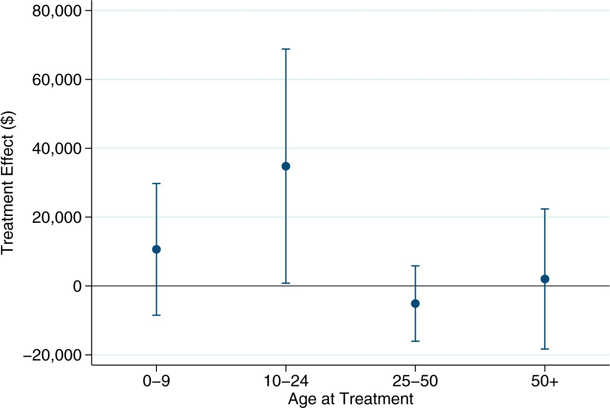
```

---

class: inverse

# What about education?

### If you move to an area with jobs that require higher levels of education, do you get more education?

---
## Estimation results: moving on schooling

```{r, out.width="90%"}
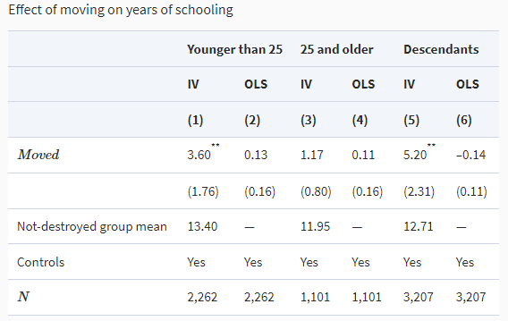
```

---
## Estimation results: moving on schooling

```{r, out.width="90%"}
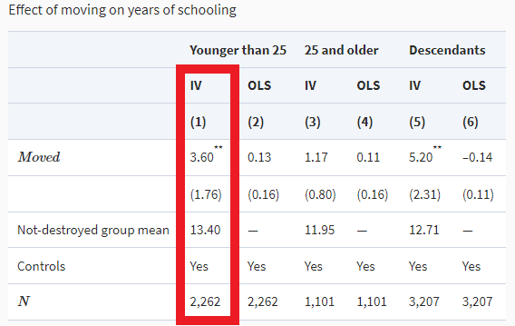
```

---
## Why are these results surprising?

The people who move away leave **comparatively high incomes** behind on the Westman Islands. 

```{r, out.width="70%", fig.height=5}
df <- read_rds(here( "data", "incomes_by_region.rds"))

df %>% ggplot(aes(x, y, colour = series)) +
    geom_line(cex = 2, alpha = .8) +
    theme_xaringan() +
    scale_color_brewer(palette = "Dark2") +
    scale_y_continuous(labels = scales::dollar_format()) +
    theme(legend.position = "bottom") +
    guides(colour = guide_legend(nrow = 2)) +
    labs(x = NULL,
         y = "Average earnings (2014$)",
         colour = NULL)
```


---
## How do the authors explain the gains?

A model of **labour misallocation** and **comparative advantage**.

.pull-left[

```{r}
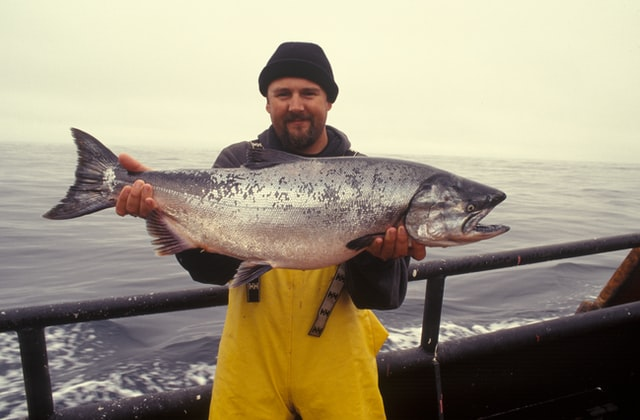
```

]

.pull-right[

```{r}
knitr::include_graphics("images/office-women.jpg")
```

]
---
## Returns to specialization
As your comparative skills in non-fishing increase, your returns to remaining in a fishing-centred economy decrease.

```{r, out.width="70%"}
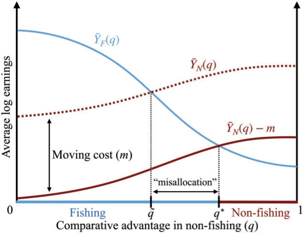
```

---
## Returns to specialization

```{r, out.width="70%"}
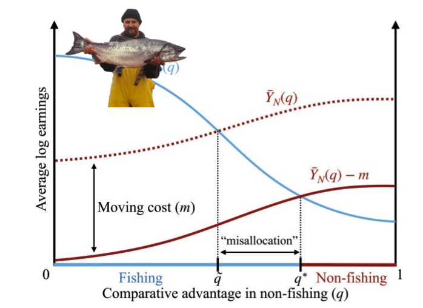
```

---
## Returns to specialization

```{r, out.width="70%"}
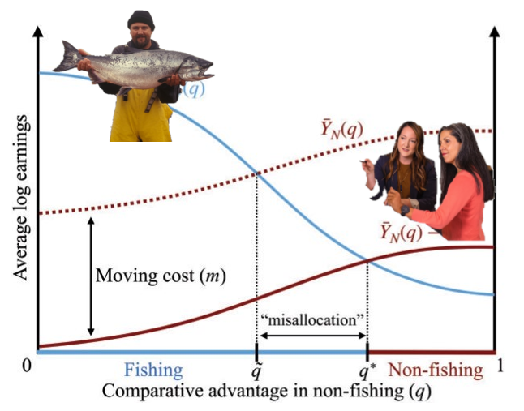
```
---

## Returns to specialization

```{r, out.width="70%"}
knitr::include_graphics("images/simple-sorting-3.PNG")
```
---

## How does theory match evidence?

We can uncover the characteristics of the compliers:

```{r, out.width= "85%"}
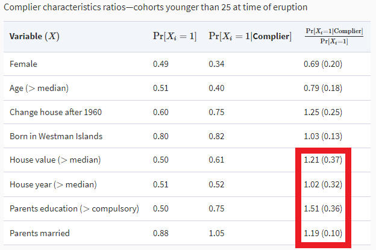
```

---
## How does theory match evidence?

Compliers have on average **parents with more education**, and are **more likely to have changed houses after 1960**, indicating less stickiness to the Westman Islands.

### "The fact that the compliers in our experiment come from homes with highly educated parents, thus, suggests that they may be particularly likely to have a comparative advantage in occupations that require relatively large amounts of education."
---
# Now with OLG!
```{r, out.width = "80%"}
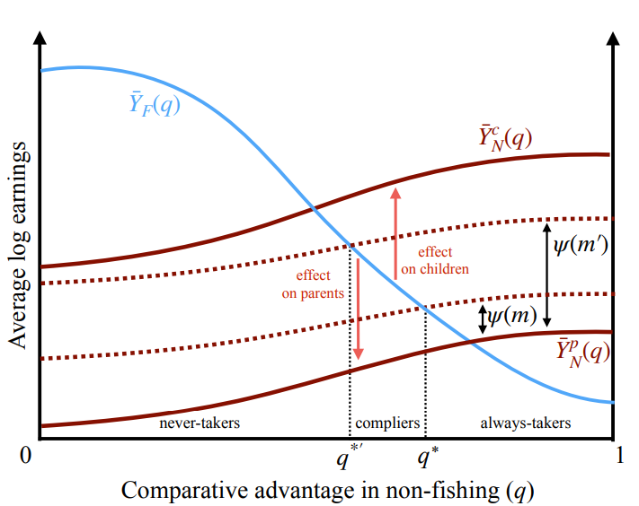
```


---

## Conclusion

The cost of migration can cause labour market mismatches and a misallocation that persists over generations.

A shock that lowered the costs of migration resulted in a transfer from parents to children for the families who were not well suited to the specific kind of work that the Westmand Islands specialized in.

---
## Questions (1)

**Inflation** was super high at the time - how does this impact getting a cash payout for your house versus keeping an asset that keeps its value?

```{r, fig.height=5, fig.width=10}
df <- read_rds(here( "data", "icelandic-inflation.rds"))

df %>% 
    ggplot(aes(year, inflation_rate)) +
    geom_point() +
    geom_line() +
    geom_hline(yintercept = 0, lty = 2) +
    geom_vline(xintercept = 1973, lty = 3) +
    theme_xaringan() +
    scale_y_continuous(labels = scales::percent_format()) +
    labs(x = NULL,
         y = NULL,
         title = "Iceland Inflation Rate (CPI)",
         caption = "Volcanic eruption in 1973 shown with dotted line")
```

---
## Questions (2)

### What does the relocation to the mainland during the eruption mean? 

If you stay somewhere for 6 months, what do you do during that time? Do you simply wait to become a fisherman again? Do you retrain? What abou those whose houses were not destroyed but were unable to work for the 6 months, and then would have to invest time and money in repairing their homes once they were allowed back on the island?

---

## Questions (3)

### The labour market mismatch is at the level of the children, yet the parents are making the decision to move!

Then you have to argue to what extent the mismatch is heritable.

---

## Summary of findings

.panelset[

.panel[.panel-name[Wald and 2SLS estimates]

.pull-left[

Wald estimate:

**$ 26,600**

]

.pull-right[

2SLS estimate:

**$ 27,500**

83% of the average earnings in the control group!

]

]
.panel[.panel-name[Marginal treatment effect]


```{r mte-fig, fig.height=5.5, out.width="80%"}
df <- read_rds(here( "data", "marginal-treatment-effect-df.rds"))

df %>% 
    mutate(type = "Point estimate",
           across(c(x, y), round)) %>% 
    ggplot(aes(x, y, colour = type)) +
    geom_point(cex = 4) +
    geom_line(cex = 2) +
    geom_hline(lty = 2, 
               cex = 2,
               aes(yintercept = 26700, colour = "Point estimate mean")) +
    scale_y_continuous(labels = scales::dollar_format()) +
    xaringanthemer::theme_xaringan() +
    scale_color_manual(values = c("#2b8cbe", "midnightblue")) +
    labs(x = "Quantile of income distribution",
         y = "Treatment effect ($)",
         colour = NULL) +
    theme(legend.position = "bottom")
```

]

.panel[.panel-name[Lifetime earnings effects]

```{r age-plot-out-2, ref.label="age-plot", echo=FALSE, warning=FALSE, fig.height= 5, out.width="80%"}

```


]
]


